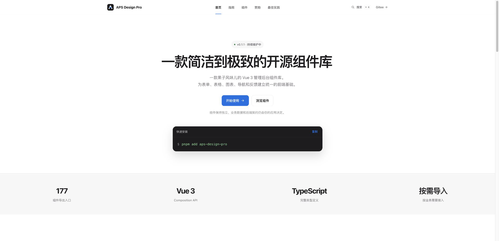

# APS Design Pro 官网

APS Design Pro 的官方文档与组件展示站。网站用 Vue 3 + Vite 构建，组件效果直接使用 npm 上的 `aps-design-pro`，文档内容从仓库内的 Markdown 读取并渲染，方便组件源码、示例代码和发布站点一起维护。

## 在线内容

官网包含五个主要板块：

- **首页**：产品定位、快速安装、能力概览和业务工作流示例。
- **指南**：架构、安装、主题、表格偏好和接入边界。
- **组件**：按 `base`、`form`、`data`、`charts`、`navigation`、`feedback`、`overlay`、`content`、`layout` 分类浏览；每个页面展示实时效果、源码、Props、Events、Slots 和使用建议。
- **赞助**：项目支持方式和合作入口。
- **最佳实践**：后台页面布局、表格工作流、反馈状态和业务接入建议。
- **共建名单**：读取仓库内 `docs/contributors.md`，按官网建设、组件拓展和后台管理模板展示公开贡献记录。

页面顶部提供全局搜索，支持 `⌘ K`（Windows/Linux 可使用 `Ctrl K`）快速定位指南和组件。

## 页面截图



截图来自本地开发服务首页，展示品牌导航、逐字 Banner、安装命令和组件能力概览。

## 本地运行

环境要求：Node.js 18+、pnpm 9+。

```bash
pnpm install
pnpm dev
```

Vite 默认使用 `5173` 端口；如果端口被占用会自动选择下一个可用端口，也可以显式指定：

```bash
pnpm dev -- --port 5186
```

## 构建与预览

```bash
pnpm verify:demos  # 检查 Markdown 演示代码与注册表是否一致
pnpm typecheck     # Vue/TypeScript 类型检查
pnpm build         # 执行演示校验、类型检查并构建静态文件
pnpm preview       # 预览 dist 目录
```

构建结果位于 `dist/`，可直接部署到 Nginx、对象存储或任意静态托管服务。生产环境若使用 history 路由，请将未知路径回退到 `index.html`。

## 文档与演示结构

```text
aps-design-website/
├── docs/                 # 指南和组件 Markdown
│   ├── architecture.md
│   └── components/<group>/<component>.md
├── src/demos/            # 与文档代码块对应的可运行 Demo
├── src/components/       # BlockDemo、代码面板、搜索和站点布局
├── src/content/          # Markdown 解析与目录生成
├── src/data/             # 站点和组件导航
└── src/views/            # 首页、指南、组件、赞助、最佳实践
```

新增组件文档时，建议保持“用处 → 代码演示 → API → Props/Events/Slots”的自然结构；复杂组件可以增加状态说明、业务场景和注意事项，不强行套用相同段落。演示代码需要在 `src/demos/registry.ts` 注册，`pnpm verify:demos` 会检查文档中的演示引用。

## 依赖方式

官网使用已发布的 npm 包，不引用组件库源码目录：

```ts
import { AppBadge, AppButton } from "aps-design-pro";
import "aps-design-pro/style.css";
```

更新组件库版本时，修改 `package.json` 中的 `aps-design-pro` 版本并重新安装依赖，再运行构建校验。

## 相关链接

- [组件库源码（Gitee）](https://gitee.com/xhyym/aps-design-pro)
- [后台演示（Gitee）](https://gitee.com/xhyym/aps-design-admin-demo)
- [npm：aps-design-pro](https://www.npmjs.com/package/aps-design-pro)
- [Apple-inspired UI Skill（ModelScope）](https://www.modelscope.cn/skills/zuoban0821/apple-inspired-ui-skill/summary)

## 开源许可

本项目采用 [MIT License](./LICENSE) 开源。
